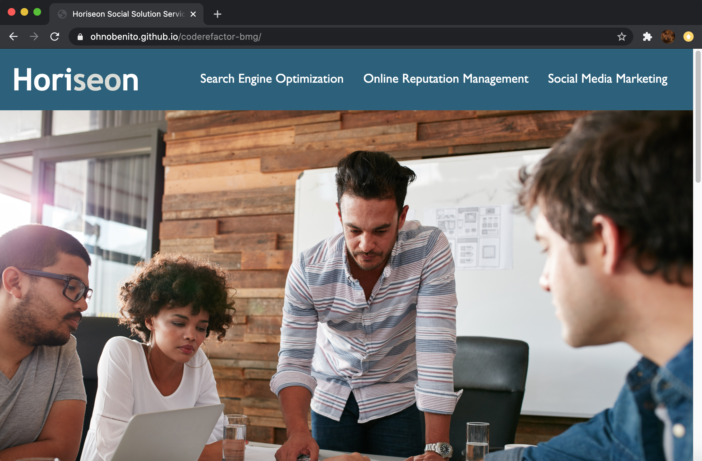

# Code Refactor : Assignment 1

Overview
For this homework assignment we were to review the code for Horiseon's website. Making sure that the code is accessible by using semantic tagging, structure of HTML elements have logical positioning, image elements contain accessible alt attributes, heading attributes are in sequential order, the title is consise and descriptive, and making sure all functionality of the page work properly.

The following steps were taken to this code:
- Changed Title to "Horiseon Social Solution Services"
- Added semantic HTML tags including: Header, Footer, Nav, Main, Section, and Aside
- Cleaned up CSS element styles to be more concise
- Added alt text to all images for accessibility
- Ensured all links worked properly

Screen Shot: 

Link: https://ohnobenito.github.io/coderefactor-bmg/
